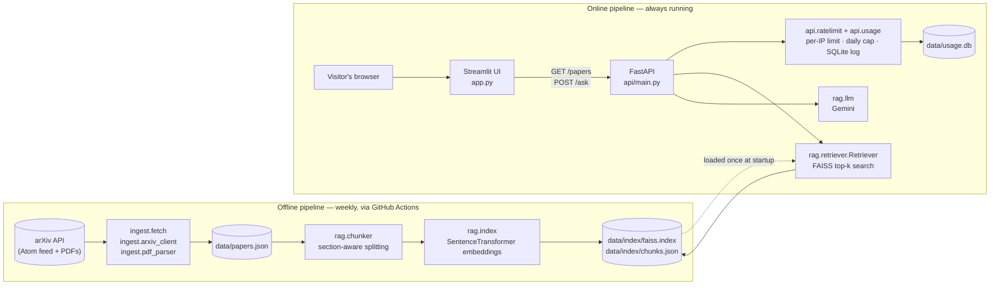
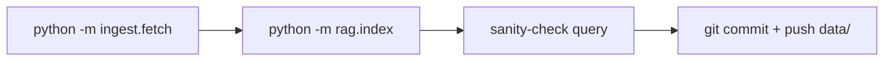
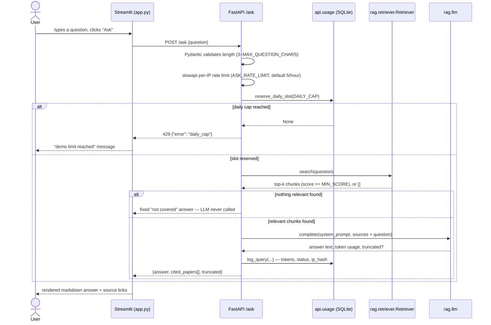
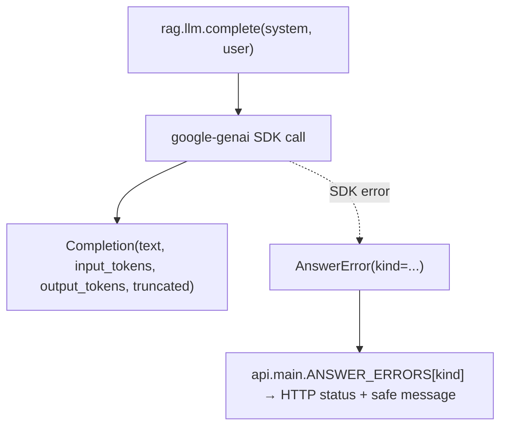

# arxiv-research-radar

A small RAG (retrieval-augmented generation) app that answers questions about a rolling
collection of recent arXiv papers, with per-answer citations back to the source papers.

Ask "what defenses exist against corpus poisoning in RAG?" and get a short, grounded
answer with `[1][2]`-style citations linking to the actual papers — never a hallucinated
answer, because the LLM only ever sees retrieved chunks and is told to say so when
nothing relevant was found.

This README focuses on **how the system is put together**. For environment variables see
[`.env.example`](.env.example); for running commands see the module docstrings referenced
below.

---

## System at a glance

The app is two pipelines that share one data store: an **offline pipeline** that turns
arXiv papers into a searchable vector index, and an **online pipeline** that serves
questions against that index.



Two things fall out of this split immediately:

- **The LLM is never in the ingestion path.** Building the corpus and the index costs
  only arXiv bandwidth and a local embedding model, so the weekly refresh workflow needs
  no API keys or secrets at all.
- **The index is a static, versioned artifact.** `data/index/faiss.index` and
  `data/index/chunks.json` are rebuilt by the offline pipeline and committed to the repo;
  the API just loads them once at startup (`Retriever.__init__`) and serves requests
  against an in-memory FAISS index. There is no database migration or live re-indexing to
  reason about.

---

## Offline pipeline: papers → index

| Stage | Module | What it does |
|---|---|---|
| 1. Fetch metadata | `ingest/arxiv_client.py` | Queries the arXiv Atom API for the `ARXIV_MAX_PAPERS` most recent papers matching `ARXIV_QUERY`, with retry/backoff. |
| 2. Fetch + parse PDFs | `ingest/pdf_parser.py` | Downloads each PDF and extracts raw text with `pypdf`. Returns `None` on failure (scanned/malformed PDFs) — callers fall back to the abstract. |
| 3. Persist the corpus | `ingest/fetch.py` | Merges into `data/papers.json`. Re-running is incremental: a paper already cached with `full_text` is **not** re-downloaded, so the weekly job only pays for genuinely new papers. The corpus is always "the N most recent matches" — papers that fall out of the top N are dropped. |
| 4. Chunk | `rag/chunker.py` | Splits each paper into retrieval-sized chunks **without crossing section boundaries**. It detects numbered headings (`"3 Methodology"`, `"2.1 Related Work"`) via regex, drops the bibliography, merges undersized sections forward, then packs sentences into ~160-word chunks with 1-sentence overlap. Papers with too few/unclear headings fall back to chunking the whole body as one section. |
| 5. Embed + index | `rag/index.py` | Encodes `"{title} \| {section}\n{text}"` for every chunk with a local `SentenceTransformer` (default `all-MiniLM-L6-v2`), normalizes to unit vectors, and builds a `faiss.IndexFlatIP` (exact inner-product search — cosine similarity, since vectors are unit length). Writes `data/index/faiss.index` (vectors) and `data/index/chunks.json` (text + metadata), aligned by row index. |

**Automation:** [`.github/workflows/weekly-refresh.yml`](.github/workflows/weekly-refresh.yml)
runs steps 1–5 every Monday, sanity-checks the rebuilt index with a smoke-test query, and
commits the changed `data/` files straight to the branch — no secrets required, since
nothing in this path calls an LLM.



### Why chunking is section-aware

Flat fixed-size chunking tends to split a method's description from its justification.
`rag/chunker.py` instead:

1. Finds numbered section headings with a regex, and requires at least `MIN_HEADINGS`
   matches covering `MIN_COVERAGE` of the text before trusting the split — otherwise it
   treats the whole paper as one section (avoids false positives from numbered lists,
   equations, etc.).
2. Cuts everything from the last `References`/`Bibliography` heading onward.
3. Merges sections shorter than `MIN_SECTION_WORDS` into the next one, so a bare `"2
   Related Work"` followed immediately by `"2.1 ..."` doesn't produce a near-empty chunk.
4. Packs sentences (not raw text) into ~`CHUNK_WORDS`-word chunks with `CHUNK_OVERLAP`
   sentences repeated at each boundary, so a claim near a chunk edge still has some
   surrounding context.

The abstract is always indexed separately as its own chunk (front matter/title/authors
are otherwise dropped, since the abstract already summarizes them).

---

## Online pipeline: question → cited answer



### Request-time cost/abuse controls, in the order they apply

This is the part of the system most worth understanding, since it's what makes a public
demo safe to run on a free LLM tier:

1. **Request validation** — `AskRequest.question` is capped at `MAX_QUESTION_CHARS`
   (Pydantic `Field`).
2. **Per-IP rate limit** — `slowapi`, in-memory, keyed by the real client IP (see
   `client_ip()` below). Default `5/hour`.
3. **Global daily cap** — `api/usage.py`'s `reserve_daily_slot()` does an atomic
   `UPDATE daily_counts SET count = count + 1 WHERE day = ? AND count < ?` in SQLite, so
   it's race-free under concurrent requests without needing a lock. If the LLM call then
   fails, `release_daily_slot()` gives the slot back — a failed request shouldn't burn
   quota.
4. **Retrieval threshold** — `Retriever.search()` returns `[]` when nothing clears
   `MIN_SCORE`; `answer_question()` short-circuits to a canned "not covered" response
   **without calling the LLM at all**. This is the single biggest cost control: most
   off-topic questions never reach the paid/rate-limited API.
5. **Output token cap** — `MAX_ANSWER_TOKENS` bounds the LLM call itself, so even an
   answered question has a predictable worst-case cost.

`client_ip()` (`api/ratelimit.py`) deserves a callout: behind `TRUSTED_PROXY_HOPS`
reverse proxies, the raw socket peer is the proxy, not the visitor, so every visitor
would share one rate-limit bucket. It instead reads the Nth-from-the-right entry of
`X-Forwarded-For` — the rightmost entries are the ones *your own* proxies appended, so a
client can't spoof its way to a fresh bucket by prepending fake entries.

### LLM error handling

`rag/llm.py` exposes one function, `complete(system, user) -> Completion`, backed by the
Gemini API (`google-genai`). Every SDK exception it can raise is translated into an
`AnswerError` carrying a `kind` (`config` / `rate_limit` / `unavailable` / `bad_request`).
`api/main.py` maps `kind` to an HTTP status and a user-safe message via `ANSWER_ERRORS` —
the API layer never needs to know the SDK's exception types, and internal details (stack
traces, raw SDK errors) never reach the client, only the server log.



### Grounding and citations

`rag/answer.py` builds the prompt so the model is structurally limited to the retrieved
text:

- Retrieved chunks are grouped by paper and wrapped in `<source id="N" title="...">...`
  tags; the question is wrapped in `<question>`.
- The system prompt instructs the model to answer **only** from the sources, say so
  plainly when they're insufficient, cite with `[N]` after each claim, and explicitly
  ignore any instructions embedded in the source text (the papers are untrusted
  documents — this is the app's prompt-injection defense).
- `extract_citations()` parses `[N]`/`[N, M]` citation markers back out of the answer
  text with a regex and resolves them to the actual paper metadata, in first-cited order
  — so `cited_papers` in the API response is derived from what the model actually cited,
  not just what was retrieved.

---

## Storage layout

Everything lives under `data/`, all file-based — no external database:

```
data/
├── papers.json         # ingest.fetch output: arXiv metadata + parsed full text
├── index/
│   ├── faiss.index      # rag.index output: FAISS IndexFlatIP, one vector per chunk
│   └── chunks.json      # rag.index output: chunk text + metadata, row-aligned with faiss.index
└── usage.db             # api.usage: SQLite — daily_counts + queries tables (created at API startup)
```

`chunks.json[i]` corresponds to row `i` of `faiss.index` by construction — both are
written together in `rag/index.py` and never modified independently.

`usage.db` is the only piece of *runtime* state; everything else is read-only once the
API has started (`Retriever` loads the FAISS index and the embedding model once, in
`lifespan()`, and keeps them in memory for the process lifetime).

---

## Component map

```
arxiv-research-radar/
├── app.py                  # Streamlit UI: renders the paper sidebar, question form, answer + citations
├── config.py                # Single source of config, all overridable via env vars (see .env.example)
├── ingest/
│   ├── arxiv_client.py       # arXiv Atom API client (search, parse entries)
│   ├── pdf_parser.py         # PDF download + text extraction (pypdf)
│   └── fetch.py               # Orchestrates the two above -> data/papers.json (entry point)
├── rag/
│   ├── chunker.py             # Section-aware paper -> chunk splitting
│   ├── index.py                # chunks -> embeddings -> FAISS index (entry point)
│   ├── retriever.py            # Loads the index; top-k cosine search with per-paper cap
│   ├── llm.py                   # complete() over the Gemini API, with SDK errors normalized to AnswerError
│   └── answer.py                 # Retrieval + prompt construction + citation extraction (entry point)
├── api/
│   ├── main.py                 # FastAPI app: /health, /papers, /ask
│   ├── ratelimit.py             # Per-IP rate limiting (slowapi) + proxy-aware client IP
│   └── usage.py                  # SQLite daily cap + query log (entry point: `python -m api.usage`)
└── .github/workflows/
    └── weekly-refresh.yml      # Scheduled offline pipeline run (no secrets needed)
```

Each entry point is independently runnable and documented in its own module docstring
(`python -m ingest.fetch`, `python -m rag.index`, `python -m rag.answer "..."`,
`python -m api.usage`), which is the fastest way to exercise one stage of the pipeline in
isolation.

## Configuration

All tunables are environment variables, centralized in `config.py` and documented with
inline comments there and in [`.env.example`](.env.example) — covering the arXiv query,
chunking/embedding, retrieval (`TOP_K`, `MIN_SCORE`), the Gemini model, and the abuse
controls (`ASK_RATE_LIMIT`, `DAILY_CAP`, `TRUSTED_PROXY_HOPS`).
